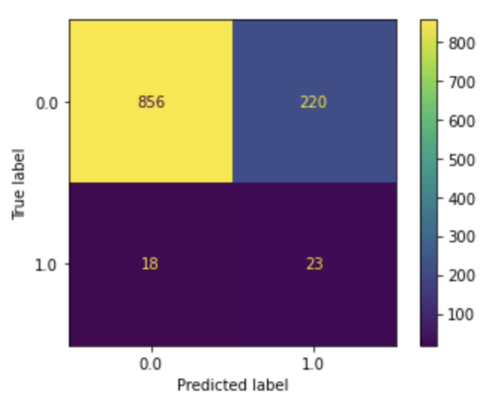
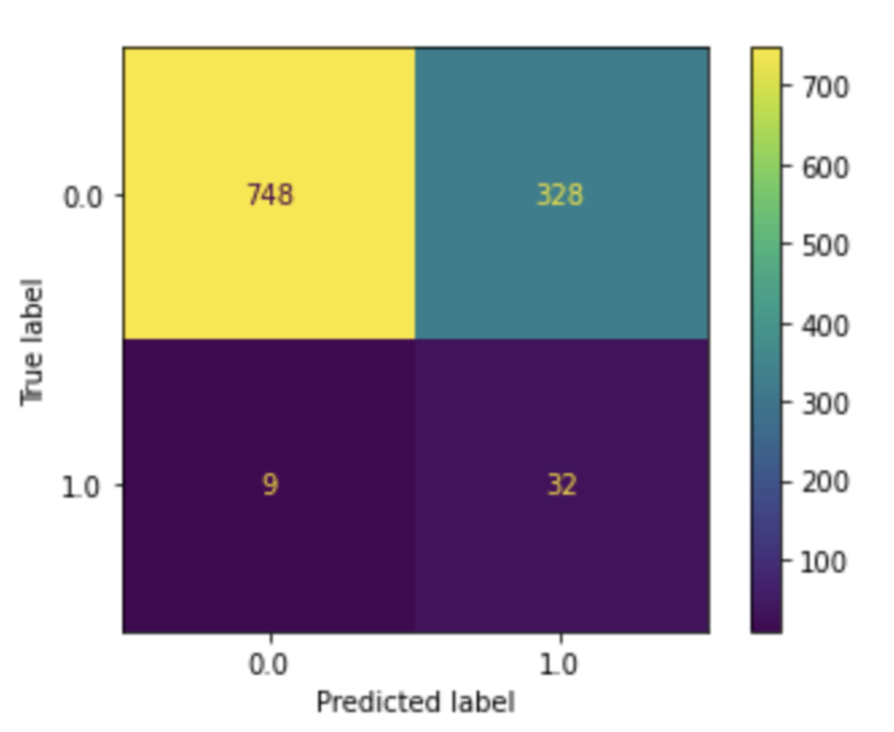
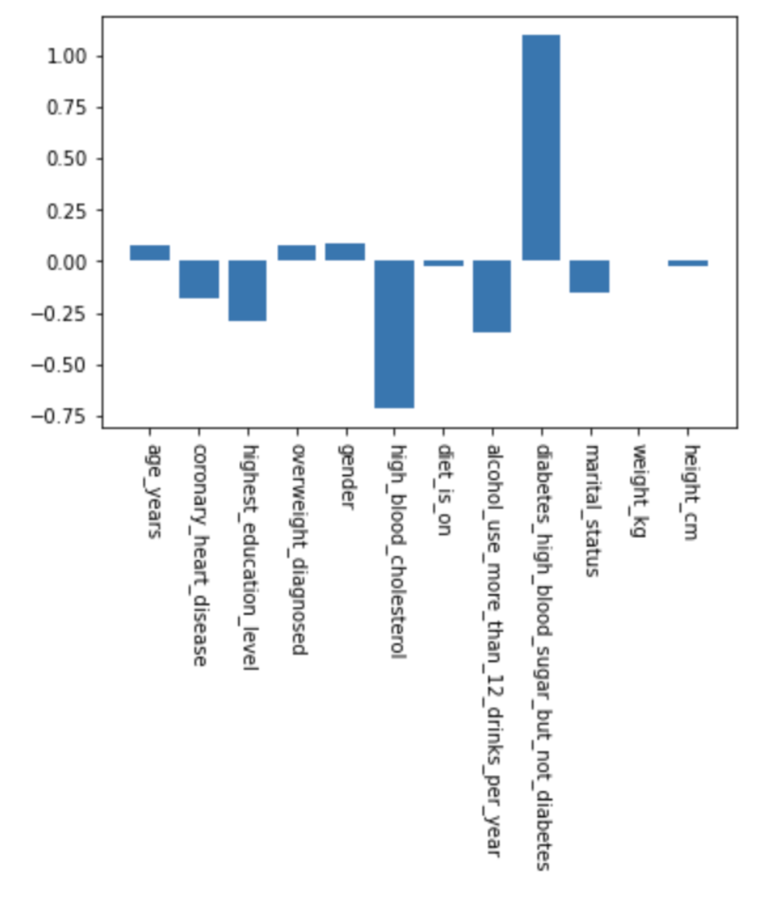
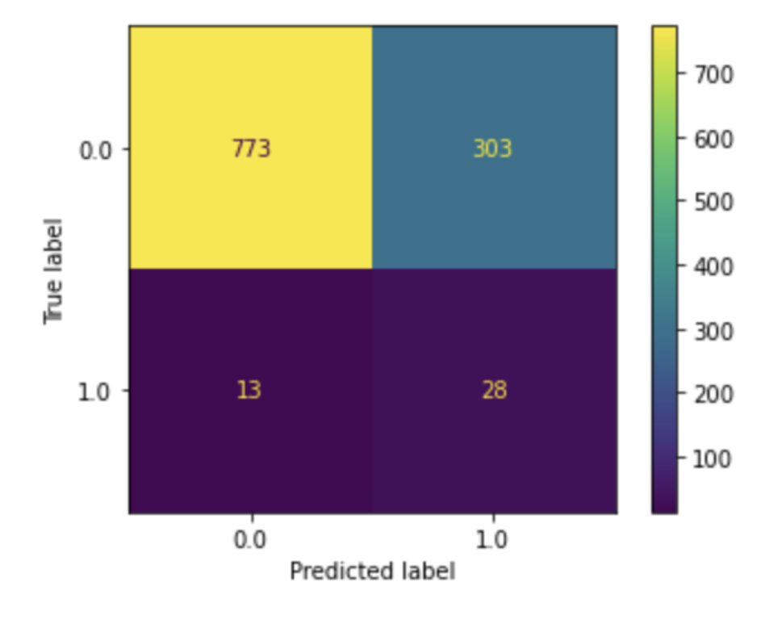
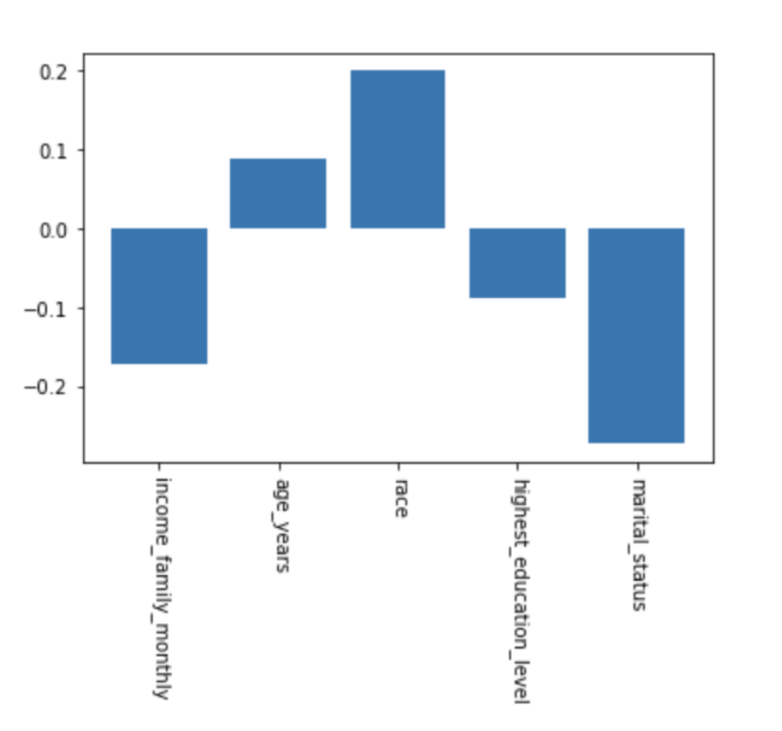

# Metis Classification Project Writeup
#### Chaya Wurman

## Abstract
The goal of this project was to predict stroke in individuals, with the hope of better understanding
which factors are strong stroke risk factors. I worked with data provided by the [NHANES study](https://www.kaggle.com/cdc/national-health-and-nutrition-examination-survey?select=demographic.csv),
which contains data about individual's demographics, current health status, medical history, and lifestyle.
I experimented with Random Forest models, XGBoost, and Logistic regression, ultimately refining
a Logistic Regression model to optimize for model interpretability and predictive power. Using this,
I was able to view which factors are strong predictors of stroke. 

## Design

The motivation of this project came from a wish to better understand strokes, given the complexity
and severity of the condition. Strokes impact ~800,000 people in the US each year, and kill close to
150,000. When strokes happen, they have the capability to cause serious and lasting damage over the course
of only a few minutes. Stroke prevention, rather than stroke treatment, is therefore a huge priority of
those studying it. Understanding who is at risk for stroke, and what factors are linked to it, has immense 
possibility to help those individuals make lifestyle changes to lower their risk and improve their quality of life.

## Data

The data is from the National Health and Nutrition Examination Survey (or NHANES), conducted by the CDC.
It is a comprehensive dataset on the health and nutritional status of US citizens. It contains 6 main tables:
 - Demographics (ex. age, race, gender, education level)
 - Diet (current diet patterns, current food intake patterns, etc.)
 - Examination (medical examination for blood pressure, grip strength, oral health, etc.)
 - Labs (cholesterol, blood mercury, etc.)
 - Questionnaire (medical history, lifestyle habits, etc)
 
 The dataset contains approximately 10,000 rows representing 10k survey participants, and around 1000 features.
 
 The target label in the dataset was a single column from the questionnare:
 "Has a doctor or other health professional ever told you that you had a stroke?", 
 indicating whether or not that person has had a stroke before.

## Algorithms

### Feature Engineering
- Pre-selected a subset of ~30 features just to initially shrink the dataset to a more analyzable size. This contained
both features known to be correlated with stroke (diabetes, high blood pressure, high blood cholesterol, etc.), as well as
some other information I thought would be interesting to view.
- Converted categorical features to binary dummy variables
- Filtered rows of the data to only include those with a valid answer for the target column, bringing us down to around 5,000 rows
- Performing data imputation of any remaining missing data, using a mean imputer for numerical data, and a most frequent imputer for categorical data.
- Oversampling (since we only had 200 positives out of 5000 rows) using SMOTENC, a distance based oversampling method that uses different methods for handling categorical and numerical data.

### Models
I experimented with the following models initially:
 - Random Forest
 - XGBoost
 - Logistic Regression

 
 I used many metrics in order to guide my initial evaluation of the various models, but prioritized recall.
 Given our problem statement, I made the assumption that correctly predicting the positive cases of stroke was more important
 that perhaps misclassifying negatives as positives, since telling someone they may be at risk of stroke even when they are not
 is more preferable than not telling someone they are at risk when they are.
 
 Ultimately I settled on fine tuning logistic regression more as it had some of the strongest initial performance, 
 and had the potential for further refinement of prioritizing various features in the model.

Furthermore, I was able to use some methods to try to train models on smaller subsets of our features, as a somewhat manual
regularization technique to also help determine which features were the most important. I went through many iterations of only considering
a subset of n (where n ranged from ~2-5) features out of all our known ones, and training the model on that.
Then, ranking all of those models by recall & F1 score would allow me to see which collection of n features created the best model.

Once I found the most predictive features, I built another logistic regression model using those, with the following scores:
```
Metrics for LogReg
  - Accuracy: 0.6982990152193375
  - Recall: 0.7804878048780488
  - Precision: 0.08888888888888889
  - F1 Score: 0.1596009975062344
  - AUC: 0.7378275455617009
```

Lastly, I thought it would be interesting to train a model using **only** demographics features, to see if we would be able
to have any predictive power using no medical data, and only using data such as age, race, income, education status, etc.
Doing this was surprisingly effective, and I was able to get a model with decent predictive success compared to my highest performer.
This also allowed me to see which demographic features were the most correlated with stroke, in our case, marital status, income, 
and race played the highest roles.

## Tools
 - Pandas & Numpy for data manipulation
 - Seaborn & Matplotlib for plotting
 - SKLearn for modeling

## Communication 
The following graphics were used in my presentation to demonstrate the final effectiveness of our models.

Logistic Regression confusion matrix:



Logistic Regression confusion matrix using only our "best" features:


Coefficient scores of our best features model:


Logistic Regression confusion matrix using only demographics features:


Coefficient scores of our demographics-only model:


